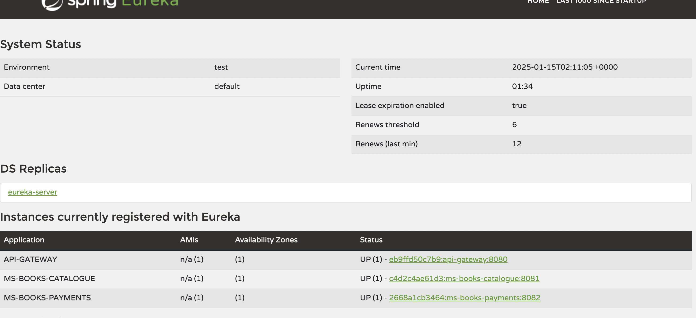

# Instalación con docker 

Se utiliza Docker para compilar y levantar todos los servicios, para ello se utiliza un docker compose para sincronizar todos los archivos Dockerfile para ello es necesario tener instalado en previamente:
  - Docker Destock o Colima para MAC
  - Docker compose

Para levantar todos los servicios se ejecutara el siguiente comando dentro de la ruta principal donde se encuentra el archivo `docker-compose.yml`
```sh
# Compilar y levantar todos los servicios
docker-compose up --build -d
```
# Instalación en maquina local
Para levantar los proyectos en la maquina local es necesario tener instalado y configurado previamente `Java 21` y correr los siguientes comandos dentro de la raiz de cada uno de los servicios

```sh
cd eureka-server && ./mvnw clean spring-boot:run
cd api-gateway && ./mvnw clean spring-boot:run
cd ms-books-catalogue && ./mvnw clean spring-boot:run
cd ms-books-payments && ./mvnw clean spring-boot:run
```

## Uso

Una vez levantado todos los servicios en sus respectivos puertos podremos acceder y hacer uso de ellos de la siguiente forma:

### Eureka

Para verificar que los servicios se encuentre registrados accedemos desde la direccion [http://localhost:8761/](http://localhost:8761/) y se deben ver reflejados todos los servicios correspondientes



### API-Gateway

Todos los servicios (ms-books-catalogue y ms-books-payments) estaran disponibles mediante este proxy, el cual esta publicado en [http://localhost:8080/](http://localhost:8080/), el mismo tiene la capacidad de tomar peticiones tipo POST y redigerir al servicio correspondiente con el verbo HTTP correcto. Para ello es necesario configurar la ruta y el verbo en el `application.yml`

Ejemplo de configuración:

``` Yml
 cloud:
    gateway:
      routes:
        - id: ms-books-catalogue-list # Nombre del servicio 
                uri: lb://ms-books-catalogue # URL del servicio, se usa lb para utilizar la url registrada en eureka
                predicates: 
                    - Path=/book # el path de la ruta a direccionar 
                filters:
                    - MethodChangeFilter=GET # se le indica el filtro a aplicar con el verbo a HTTP correcto
```

### ms-books-catalogue

Este servicio esta disponible mediante el proxy o mediante la ruta [http://localhost:8081/](http://localhost:8081/), tiene disponible la documentación de los endpoint publicados mediante [swagger-ui](http://localhost:8081/swagger-ui/index.html)

``` bash
# Petición Ejemplo mediante Proxy

curl --location --request POST 'http://localhost:8080/book'

# Petición Ejemplo sin proxy

curl --location --request GET 'http://localhost:8081/book'

```

### ms-books-payments

Este servicio esta disponible mediante el proxy o mediante la ruta [http://localhost:8082/](http://localhost:8082/), tiene disponible la documentación de los endpoint publicados mediante [swagger-ui](http://localhost:8082/swagger-ui/index.html)

``` bash
# Petición ejemplo con proxy

curl --location 'http://localhost:8080/payment' \
--header 'Content-Type: application/json' \
--data '{
  "name": "string",
  "lastName": "string",
  "andress": "string",
  "amount": 20,
  "status": "COMPLET",
  "paymentType": "CREDIT",
  "books": [
    {
      "id": 3,
      "quantity": 1
    }
  ]
}'

# Petición ejemplo sin proxy

curl --location 'http://localhost:8082/payment' \
--header 'Content-Type: application/json' \
--data '{
  "name": "string",
  "lastName": "string",
  "andress": "string",
  "amount": 20,
  "status": "COMPLET",
  "paymentType": "CREDIT",
  "books": [
    {
      "id": 3,
      "quantity": 1
    }
  ]
}'

```

## Consideraciones

Los proyectos utilizan base de datos en memoria H2, para acceder a la consola mediante el path `/h2-console/` correspondiente de cada ms